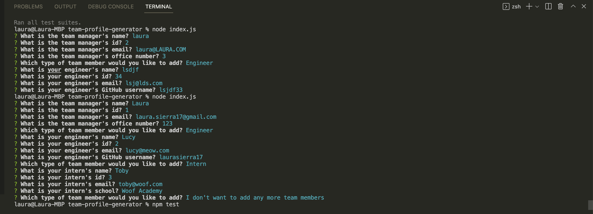

# Team Profile Generator

[](https://opensource.org/licenses/MIT)

## Description
A Node.js command-line application that takes in information about employees on a software engineering team and generates an HTML webpage that displays summaries for each person.

Here's the link to how it works: [click here](https://www.youtube.com/watch?v=_epIiZmcia8).

## Screenshots
The functionality:


# Table of Contents
* [Installation](#installation)
* [Usage](#usage)
* [License](#license)
* [Contributing](#contributing)
* [Tests](#tests)
* [Technologies Used](#technologies-used)
* [Code Snippets](#code-snippets)
* [Questions](#questions)
* [User Information](#user-information)

## Installation
To install necessary dependencies, run the following command:
```
npm i
```

## Usage
Install the dependencies and you're ready to go.

## License 
This project is licensed under the MIT license.

## Contributing
Contact me.

## Tests
To run tests, run the following command:
```
npm test
```

## Technologies Used
- Node.js
- Inquirer
- Jest

## Code Snippets
```javascript
// Function to ask user manager questions or which member to pick next
function nextMember() {
    // Called after the manager info has been filled out and when called by other functions
    inquirer.prompt(
        {
            type: "list",
            name: "next",
            message: "Which type of team member would you like to add?",
            choices: ["Engineer", "Intern", "I don't want to add any more team members"]
        }).then(answers => {
            switch (answers.next) {
                case 'Engineer':
                    engineer();
                    break;
                case 'Intern':
                    intern();
                    break;
                default:
                    // Generate markup with user input
                    fs.writeFile('./dist/index.html', template(teamInfo), err => {
                        if (err) console.log(err);
                    })
                    return;
            }
        })
}

// Function call to initialize app
manager();
```
A must for this project is that the user, upon running the application, will be immediately prompted for information on their manager (as you can see in the last line). It is within `manager()` that the `nextMember()` function is called and the user is asked to select which type of employee they'd like to add next: an Engineer, an Intern, or none. Both Engineer and Intern have similar functions where the user is prompted questions related to those types of employees. If they choose not to add any more employees, we will generate an HTML file, populated with the information gathered from the prompts.

## Questions
If you have any questions about the repo, open an issue or contact me directly at laura.sierra17@gmail.com.
You can find more of my work at [laurasierra17](https://www.github.com/laurasierra17).

## User Information
- [LinkedIn](https://www.linkedin.com/in/laurasierra2022)
- [Portfolio](http://www.laura-sierra.com)
